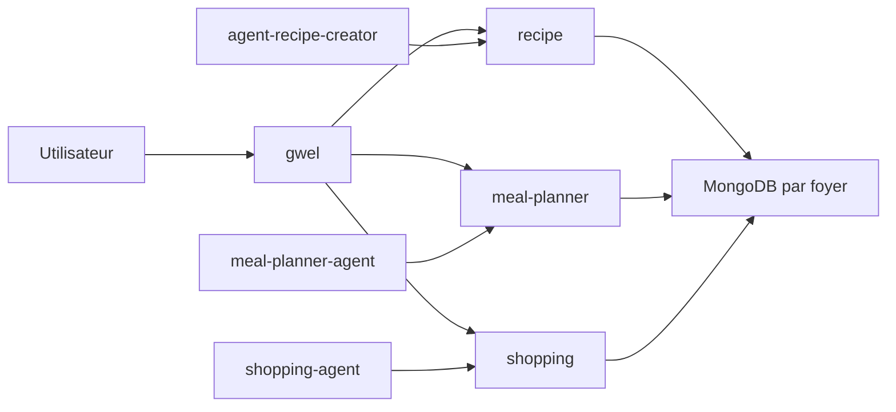

# Contributeurs

Cette page donne une lecture technique volontairement synthétique. Le cadrage complet reste dans le dossier `docs/` du repo.

## Repos

| Repo | Rôle |
|---|---|
| `recipe-project` | Cadrage, communication, releases, décisions et documentation produit. |
| `recipe` | Backend FastAPI du domaine recettes. Source de vérité pour recettes, ingrédients, équipements, tags et catalogues. |
| `gwel` | Frontend Vue 3 / TypeScript, façade utilisateur des trois domaines. |
| `agent-recipe-creator` | Agent de création et normalisation assistée des recettes. |
| `meal-planner` | Backend cible de planification des repas. |
| `meal-planner-agent` | Agent cible de recommandation et d'aide à la planification. |
| `shopping` | Backend cible des listes de courses. |
| `shopping-agent` | Agent cible de contrôle et d'assistance des courses. |
| `dataset` | Données, exports historiques et explorations. |

## Architecture

La cible est une architecture microservices simple :

- un service métier par domaine ;
- un agent par domaine ;
- MongoDB comme stockage court terme ;
- Keycloak comme cible d'authentification ;
- MCP pour exposer des outils aux agents ;
- `gwel` comme interface unique.



## Conventions de travail

Les principes attendus sont :

- KISS : garder les paliers simples et utilisables ;
- DRY : factoriser seulement ce qui est réellement partagé ;
- SRP : un domaine ne porte pas la responsabilité d'un autre ;
- validation humaine pour les sorties IA ;
- contrats API explicites avant complexification agentique ;
- migration traçable et rejouable.

## Commandes utiles

Lancer le stack recette :

```bash
cd /Users/killian/Karned/projets/Rekipe
./start_services.sh setup
./start_services.sh up recipe-stack
```

Backend recette seul :

```bash
cd /Users/killian/Karned/projets/Rekipe/recipe
MODE=all uv run --frozen python main.py
```

Frontend :

```bash
cd /Users/killian/Karned/projets/Rekipe/gwel
npm install
npm run dev -- --host 127.0.0.1 --port 5173
```

Documentation :

```bash
cd /Users/killian/Karned/projets/Rekipe/recipe-project
python -m pip install -r requirements-docs.txt
mkdocs serve
```

## Points d'attention

- Les recettes doivent stocker des références UUID vers les catalogues, pas dupliquer les objets catalogue.
- Les recettes `draft` ne doivent pas être sélectionnables par le meal planner.
- Les données legacy utiles doivent conserver leurs identifiants d'origine.
- Les agents ne doivent pas devenir propriétaires de l'état fonctionnel.
- Le socle partagé doit rester minimal pour éviter de recréer un monolithe implicite.
